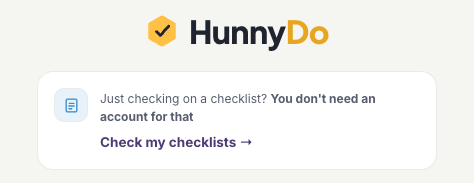
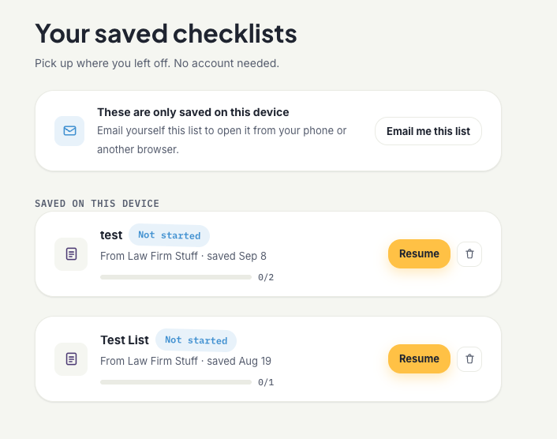
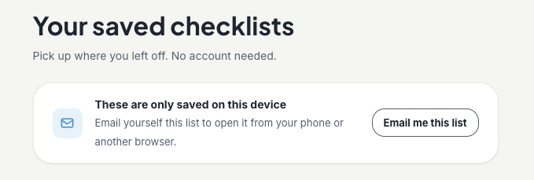

You've sent a client a checklist. They open it, get through two of five items, then a Slack message pulls them away. Ten minutes later they're back to their inbox, the tab is closed, and the only way back to that checklist is finding the original email and clicking the link again, assuming they can find it. Multiply that by every client, every checklist, and it's a spiral of missed deadlines and manual follow-ups.

That's the gap we closed with this release. Checklists now save themselves, and clients get one place to find everything you've sent them.

## Every checklist saves itself, automatically

As soon as a client opens a checklist you've assigned them, it's saved: no button to tap, nothing to set up, no account to create. If they close the tab mid-way through, the checklist is still there the next time they come back to HunnyDo. This works exactly the way the rest of HunnyDo does for your clients: zero friction, nothing to remember, nothing to sign up for.

**Saved automatically, no action needed:**

1. Client opens the checklist link -> *instant*
2. It's added to "Your saved checklists" -> *automatic*
3. Client finishes it whenever they're ready -> *no reminder needed*

## One page for everything they've been sent

Clients now have a single page: **Your saved checklists** that lists every active checklist that's been assigned to them, regardless of who sent it or when. Each item shows who it came from, how far along they are, and a Resume button that drops them right back where they left off. Finished checklists stay there too, so there's never a moment where a client has to ask "wait, did I already send that over?"

### It follows them to another device, without a password

By default, a saved checklist lives on the device and browser it was opened on — the same way it always has. If a client wants that list on their phone too, they can email themselves a link straight from the saved checklists page. We verify it with a one-time code sent to their inbox, the same lightweight verification we already use to open checklists in the first place. No password, no account, nothing new to remember.

The goal wasn't to add an account system. It was to make the thing that already worked — a link in an email — impossible to lose.

## What this changes for you

None of this requires you to do anything differently. You send checklists the same way you always have. What changes is what happens after you hit send:

- **Fewer "can you resend that?" messages.** The checklist is always one click away from the client's own saved list, not buried in an inbox.
- **Higher completion on multi-step checklists.** A client who gets interrupted has an easy, obvious way back in instead of starting over from your original email.
- **No new setup for you or your clients.** Saving is automatic, and syncing across devices is opt-in and verification-based — nobody's creating a password.

If you're already sending checklists through HunnyDo, this is live for every client link — nothing to turn on. If you haven't tried HunnyDo yet, [get started for free](/signup) and send your first checklist to see it save itself. For more on getting checklists actually completed once they land, [our onboarding checklist guide](/blog/5-minute-onboarding-checklist) is a good next read.